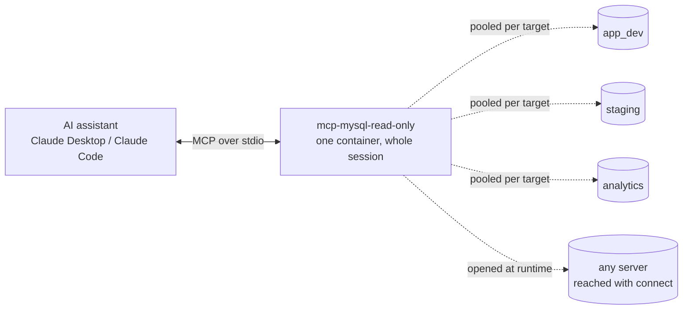
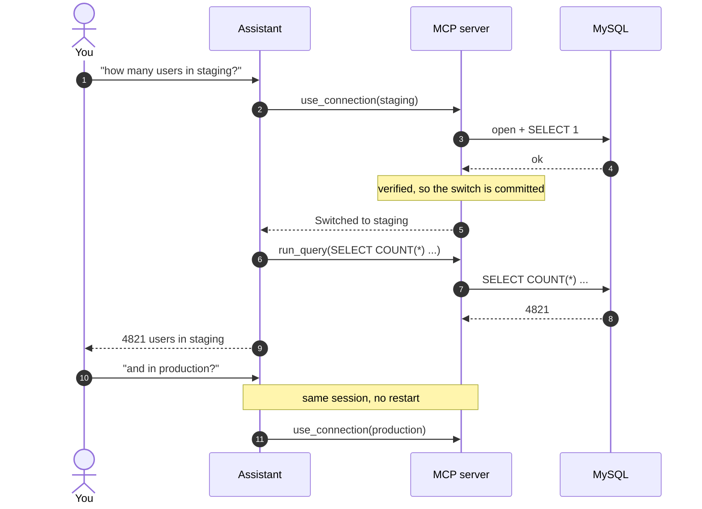
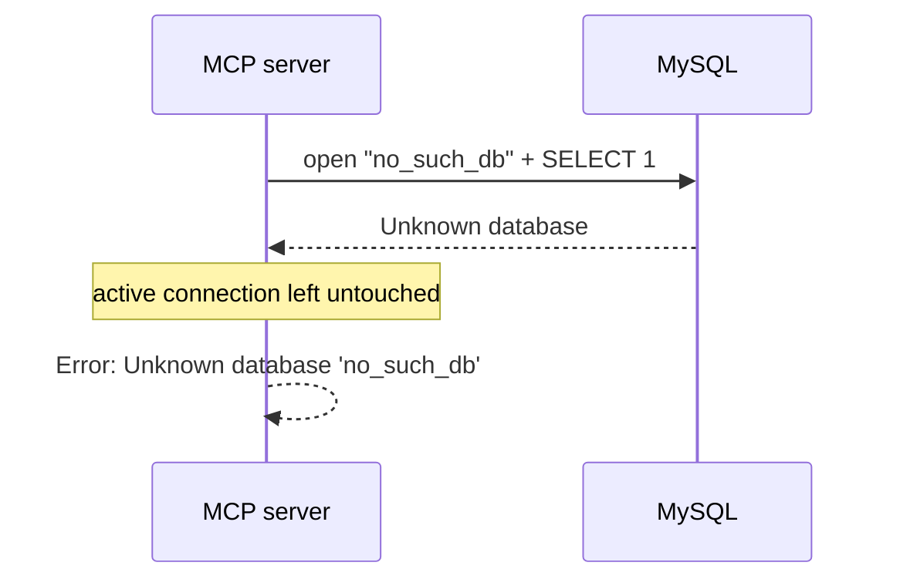
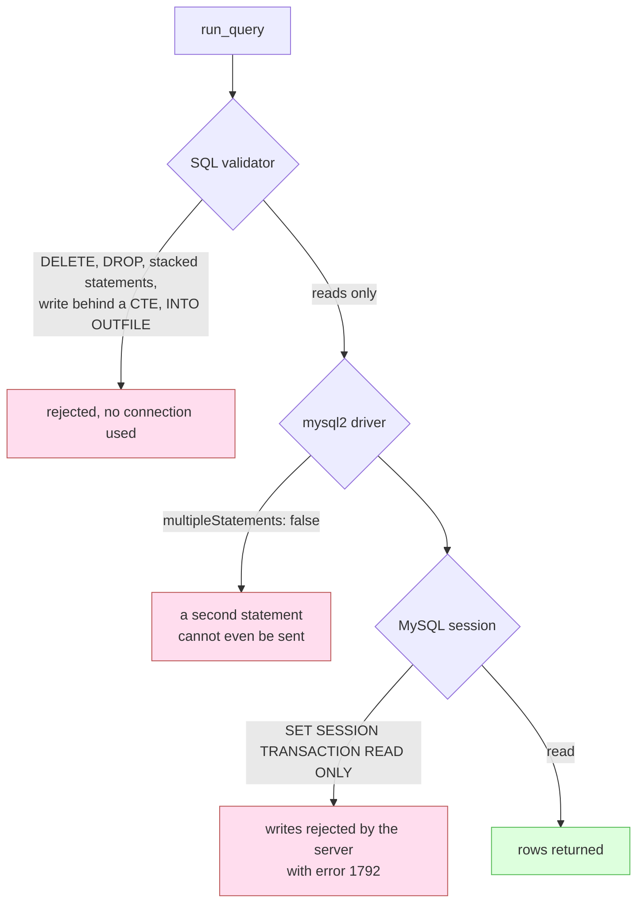

# mcp-mysql-read-only

[](https://github.com/shibbirweb/mcp-mysql-read-only/actions/workflows/ci.yml)
[](https://hub.docker.com/r/shibbirweb/mcp-mysql-read-only)
[](https://hub.docker.com/r/shibbirweb/mcp-mysql-read-only)
[](LICENSE)

An [MCP](https://modelcontextprotocol.io) server that gives an AI assistant read-only access to MySQL, and lets it **change database, server and credentials mid-conversation without restarting the client**.

Most MySQL MCP servers read their connection from environment variables once at startup. Pointing one at a different database means editing a config file and restarting the assistant, which loses your conversation. This server keeps the connection as runtime state, so switching is just another tool call.

Runs entirely in Docker. Nothing is installed on your machine.



The container lives for the whole session, so the active connection is just state inside it. Switching selects a different pool rather than reconnecting, and switching back reuses a warm one.

---

## Quick start

```bash
docker run -i --rm \
  --add-host host.docker.internal:host-gateway \
  -e MYSQL_HOST=host.docker.internal \
  -e MYSQL_USER=readonly \
  -e MYSQL_PASSWORD=secret \
  -e MYSQL_DATABASE=my_database \
  shibbirweb/mcp-mysql-read-only
```

Use `host.docker.internal` to reach a MySQL running on the same machine as Docker. Inside the container, `localhost` means the container itself.

### Claude Desktop

Add to `claude_desktop_config.json`:

```json
{
  "mcpServers": {
    "mysql": {
      "command": "docker",
      "args": [
        "run", "-i", "--rm",
        "--add-host", "host.docker.internal:host-gateway",
        "-e", "MYSQL_HOST=host.docker.internal",
        "-e", "MYSQL_USER=readonly",
        "-e", "MYSQL_PASSWORD=secret",
        "-e", "MYSQL_DATABASE=my_database",
        "shibbirweb/mcp-mysql-read-only"
      ]
    }
  }
}
```

### Claude Code

Same shape, in `.mcp.json` at your project root:

```json
{
  "mcpServers": {
    "mysql": {
      "command": "docker",
      "args": [
        "run", "-i", "--rm",
        "--add-host", "host.docker.internal:host-gateway",
        "-e", "MYSQL_HOST=host.docker.internal",
        "-e", "MYSQL_USER=readonly",
        "-e", "MYSQL_PASSWORD=secret",
        "-e", "MYSQL_DATABASE=my_database",
        "shibbirweb/mcp-mysql-read-only"
      ]
    }
  }
}
```

Restart the client once. After that you never need to restart it to change database.

> Credentials in these files sit on disk in plain text. Prefer a MySQL account with only `SELECT` grants, and keep the file out of version control. See [Security](#security).

---

## Switching connections

Just ask. These map onto the connection tools:

> "switch to the staging database"
> "what tables are in `analytics`?"
> "connect to MySQL on 10.0.0.5 as reporting_user"

| Want | Restart? |
| --- | --- |
| Another database on the same server | No |
| Another named profile | No |
| A different server or credentials | No |
| A new permanent profile in `MYSQL_PROFILES` | Yes, once |



A switch that fails verification is never committed, so the previous connection stays active and the session keeps working:



### Named profiles

Define several connections up front with `MYSQL_PROFILES`, a JSON object:

```json
{
  "local":   { "host": "host.docker.internal", "user": "root",      "password": "",       "database": "app_dev" },
  "staging": { "host": "db.staging.internal",  "user": "readonly",  "password": "secret", "database": "app" },
  "reports": { "host": "db.staging.internal",  "user": "readonly",  "password": "secret", "database": "analytics" }
}
```

Passed as a single environment variable:

```bash
docker run -i --rm \
  -e MYSQL_PROFILES='{"local":{"host":"host.docker.internal","user":"root","password":"","database":"app_dev"}}' \
  -e MYSQL_DEFAULT_PROFILE=local \
  shibbirweb/mcp-mysql-read-only
```

`host` defaults to `host.docker.internal`, `port` to `3306`, `password` to empty. `user` and `database` are required; a profile missing either is skipped with a warning rather than taking the server down.

### Reaching somewhere not in the profiles

The `connect` tool takes a host, user, password and database at runtime and keeps it for the rest of the session under an alias. Nothing is written to disk, and no restart is involved, so you never have to edit `MYSQL_PROFILES` just to look at one database once.

---

## Tools

### Connection

| Tool | Purpose |
| --- | --- |
| `current_connection` | Which server and database is active |
| `list_connections` | Available profiles, `*` marks the active one |
| `list_databases` | Databases on the connected server |
| `use_database` | Switch schema on the current server |
| `use_connection` | Switch to a named profile, optional `database` override |
| `connect` | Open any server with explicit credentials, optional `alias` |

### Reading

| Tool | Purpose |
| --- | --- |
| `list_tables` | Tables in the active database |
| `describe_table` | Columns and types for one table |
| `get_table_indexes` | Indexes for one table |
| `get_foreign_keys` | Foreign key relationships for one table |
| `get_table_sample` | Up to 50 sample rows |
| `run_query` | One read-only statement |

Every reading tool also accepts an optional `database`, applied to that call only, leaving the active connection alone. Useful for comparing two databases without switching back and forth.

`use_database`, `use_connection` and `connect` each open the connection and run `SELECT 1` before committing the switch, so a bad database name or unreachable host fails immediately. A failed switch leaves the previous connection active.

---

## Configuration

| Variable | Default | Purpose |
| --- | --- | --- |
| `MYSQL_PROFILES` | none | JSON object of named profiles |
| `MYSQL_DEFAULT_PROFILE` | none | Which profile starts active |
| `MYSQL_HOST` | `host.docker.internal` | Single-connection fallback |
| `MYSQL_PORT` | `3306` | " |
| `MYSQL_USER` | none | " |
| `MYSQL_PASSWORD` | empty | " |
| `MYSQL_DATABASE` | none | " |
| `MYSQL_QUERY_TIMEOUT_MS` | `30000` | Statement timeout |
| `MYSQL_CONNECT_TIMEOUT_MS` | `10000` | Connection timeout |

`MYSQL_USER` plus `MYSQL_DATABASE` register a profile named `default`. None of these are required: with no configuration at all the server still starts, and the tools tell you to call `connect`.

Starting profile: `MYSQL_DEFAULT_PROFILE` if it names a real profile, else `default`, else the first one defined.

---

## Security

Two independent layers keep this read-only, so a hole in one is not automatically a write.



**A SQL validator.** Only `SELECT`, `WITH`, `SHOW`, `DESCRIBE`, `DESC` and `EXPLAIN` may lead a statement. Before any keyword check, string literals, backtick identifiers and `--`, `#` and `/* */` comments are blanked out, so a keyword or semicolon hidden inside a literal is never mistaken for SQL. Statement stacking is rejected. `WITH` and `EXPLAIN ANALYZE` have their bodies scanned for write keywords, because both can carry a write behind a harmless first word. `INTO OUTFILE`, `INTO DUMPFILE`, `LOAD DATA`, `SLEEP()` and `BENCHMARK()` are blocked. Table and database names passed as tool arguments must match `^[A-Za-z0-9_$]+$`, so they cannot break out of the identifier they are interpolated into.

**The MySQL session.** Every pooled connection runs `SET SESSION TRANSACTION READ ONLY` and `SET SESSION MAX_EXECUTION_TIME`. With autocommit on, each statement is its own read-only transaction, so the server rejects a write with error 1792 even if the validator were somehow bypassed. The driver runs with `multipleStatements: false`, so a second statement cannot be smuggled in at all.

### What this is not

**This is a guard, not a permission system.** It stops an assistant from writing through *this* server. It does not stop anyone holding the same credentials from writing through any other client.

**Point it at a read-only MySQL user.** This is the real protection:

```sql
CREATE USER 'readonly'@'%' IDENTIFIED BY 'a strong password';
GRANT SELECT ON your_database.* TO 'readonly'@'%';
```

With that, a bug in this server still cannot write anything.

Other limits worth knowing:

- `SLEEP()` and `BENCHMARK()` are blocked outright as a blunt guard against hanging the session.
- A column named exactly `update` or `delete` inside a `WITH` query is rejected. Backtick it.
- Results are truncated to 100 rows in the tool output. The query itself is not limited, so add a `LIMIT` when reading large tables.

---

## Known behaviour

**Parallel tool calls.** The active connection is a single piece of process state. If a client issues several tool calls in one batch they are handled concurrently, so a `use_database` batched alongside a `run_query` is not guaranteed to land first. Sequential calls behave as expected. When a read must be pinned to a particular database, pass the per-call `database` argument instead of relying on a switch made in the same batch.

**Shutdown.** The server exits on `SIGINT`/`SIGTERM`, not when stdin closes. Open pool sockets keep the event loop alive, and stdin reaching EOF only means no further requests were buffered; treating that as a shutdown signal tears down pools while calls are still in flight. Any script driving the server directly should read until it has the responses it expects, then terminate the process.

---

## Development

Everything runs in Docker, so a clone and Docker are the only requirements:

```bash
git clone https://github.com/shibbirweb/mcp-mysql-read-only.git
cd mcp-mysql-read-only
./scripts/test-in-docker.sh
```

That starts a throwaway MySQL container, builds the test image, runs the full suite against it and tears everything down. Your own MySQL is never touched.

With Node 22 installed locally:

```bash
npm ci
npm run build
npm run test:unit          # no database needed
npm test                   # integration tests need MySQL, see below
```

Integration tests read `TEST_MYSQL_HOST`, `TEST_MYSQL_PORT`, `TEST_MYSQL_USER`, `TEST_MYSQL_PASSWORD`. They create and drop two scratch databases (`mcp_test`, `mcp_test_alt`), so point them at a disposable server. When MySQL is unreachable they skip rather than fail.

### Project structure

```
src/
  index.ts                Entry point
  ApplicationFactory.ts   Composition root: the only file that wires things together
  types/                  Interfaces and type aliases, one file per concern
  errors/                 Named error classes
  domain/                 ConnectionTarget, ConnectionProfile (immutable value objects)
  config/                 Reading configuration from the environment
  connections/            Target factory, profile registry, connection manager
  database/               Pool manager, read-only session initializer, query executor
  validation/             SQL skeletonizer, validators, rules/
  formatting/             Response and row rendering
  tools/                  BaseTool, DatabaseScopedTool, connection/, reading/
  server/                 McpMySqlServer
```

Dependencies point inward, and no class constructs its own collaborators: everything is injected by `ApplicationFactory`, which is what lets each part be unit tested without a database or the environment.

Developer documentation, including why each class is built the way it is and which design patterns are used where, lives in the [wiki](https://github.com/shibbirweb/mcp-mysql-read-only/wiki) (source in [`docs/wiki/`](docs/wiki/)).

---

## Contributing

Pull requests target `master`. CI runs the full suite against MySQL 8.0 and 8.4 and builds the image for amd64 and arm64. Please keep changes covered by tests, and update `docs/wiki/` when behaviour changes.

## License

[MIT](LICENSE) © Md. Shibbir Ahmed
