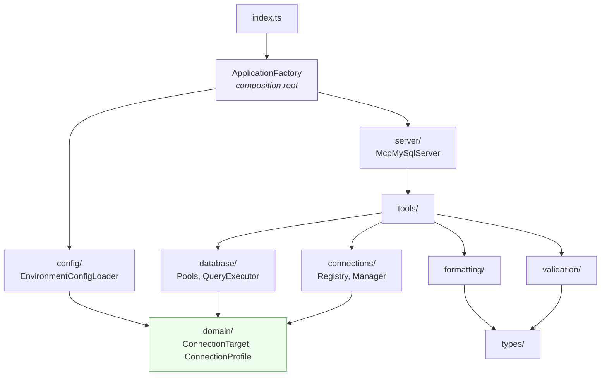
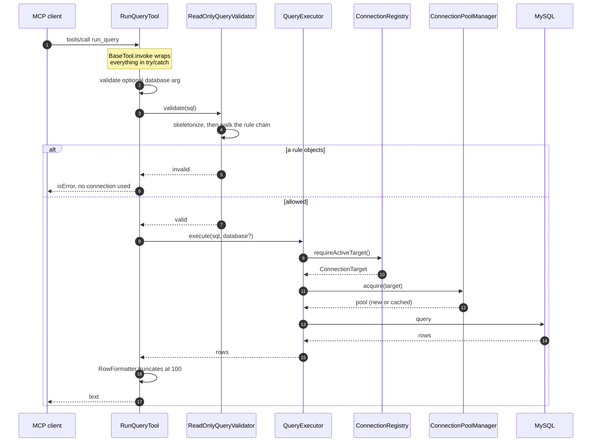
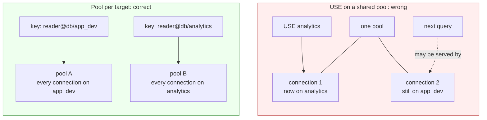

# Architecture

## Folder layout

```
src/
  index.ts                  Entry point: construct and start, nothing else
  ApplicationFactory.ts     Composition root: the only file that wires things

  types/                    Interfaces and type aliases, one file per concern
  errors/                   Named error classes
  domain/                   ConnectionTarget, ConnectionProfile
  config/                   EnvironmentConfigLoader, PackageVersionLoader
  connections/              Target factory, registry, manager
  database/                 Pool manager, session initializer, query executor
  validation/               Skeletonizer, validators, rules/
  formatting/               ToolResponse, RowFormatter
  tools/                    BaseTool, DatabaseScopedTool, connection/, reading/
  server/                   McpMySqlServer
```

Dependencies point inward. `domain/` imports nothing of ours. `validation/` and `formatting/` import only types. `tools/` receives collaborators and constructs none. Only `ApplicationFactory` knows the whole graph.



Everything below `ApplicationFactory` is constructed there and injected downward, which is why no arrow ever points back up.

## Responsibilities

| Class | Responsibility | Holds state? |
| --- | --- | --- |
| `ApplicationFactory` | Build the object graph | No |
| `McpMySqlServer` | Register tools, run, shut down | Shutdown flag |
| `EnvironmentConfigLoader` | Read configuration, report problems | No |
| `PackageVersionLoader` | Read the handshake version from `package.json` | No |
| `ConnectionTargetFactory` | Build targets from untrusted input | No |
| `ConnectionRegistry` | Known profiles, the active connection | **Yes** |
| `ConnectionManager` | Change the active connection safely | No |
| `ConnectionPoolManager` | One pool per connection, LRU | **Yes** |
| `SessionInitializer` | Make each connection read-only | No |
| `QueryExecutor` | Run a query against the right pool | No |
| `ReadOnlyQueryValidator` | Decide if a statement may run | No |
| `IdentifierValidator` | Guard interpolated identifiers | No |
| `RowFormatter` / `ToolResponse` | Render output | No |
| `BaseTool` subclasses | One tool each | No |

Only two classes hold mutable state. Everything else is a pure collaborator.

## Request flow

A `run_query` call:



Validation always precedes any network work, so a rejected query costs no connection.

## The one piece of mutable state

Two fields on `ConnectionRegistry`:

```ts
private activeName: string | null = null;
private activeTarget: ConnectionTarget | null = null;
```

Changing them changes where every subsequent query goes. There is no reconnect step: `ConnectionPoolManager` keys its cache by `ConnectionTarget.key()`, so pointing at a different database selects a different pool, and pointing back reuses the original.

That is the entire mechanism behind switching without a restart.

### Why not issue `USE <database>`?

It looks simpler but makes the pool lie. A pool opens several connections and `USE` affects only the one it ran on, so a later query served by a different connection would silently use the old schema.



Keying pools by database means every connection in a pool was opened against the right schema from the start, and switching back is free.

### Consequence: parallel calls race

The active connection is process-wide, so two concurrently handled tool calls share it. A client that batches calls can issue `use_database` and `run_query` together and see the query answered first.

This is a known trade rather than an oversight. Scoping the connection per request would require the MCP protocol to carry a session identifier it does not have. The mitigation is the optional `database` argument on every read tool, which resolves its own target and ignores the shared state entirely. See [Tools](Tools).

## Why the composition root

Nothing constructs its own dependencies, which means nothing can be tested in isolation unless something assembles them. `ApplicationFactory` is that something, and keeping it to one file means the wiring is reviewable in one place.

The payoff is concrete: `EnvironmentConfigLoader` takes the environment as a constructor argument, so its tests are object literals rather than module reloads, and `ConnectionManager` takes the pool manager, so failed switches are tested with a fake instead of a real database. See [Design Patterns](Design-Patterns).

## Why no configuration file

An earlier design read profiles from a bind-mounted JSON file. It was dropped because a mount is one more thing that can be silently wrong (a missing host directory is created root-owned, a relative path resolves somewhere unexpected) and the failure shows up as an empty profile list rather than an error.

More importantly, a file suggests that editing it is how you change connection. It is not. `connect` is, and it needs no file, no mount and no restart. `MYSQL_PROFILES` is only a convenience for connections you use constantly.

## Why stdio and not HTTP

MCP supports both. Stdio means the client owns the process lifetime, there is no port to bind, nothing to authenticate, and nothing is reachable from outside the machine. For a process holding database credentials, not listening on a socket is a feature.

The cost is that stdout is sacred: it carries the JSON-RPC stream, so one stray `console.log` corrupts the protocol. Every diagnostic in this codebase goes through the injected logger, which writes to stderr.
