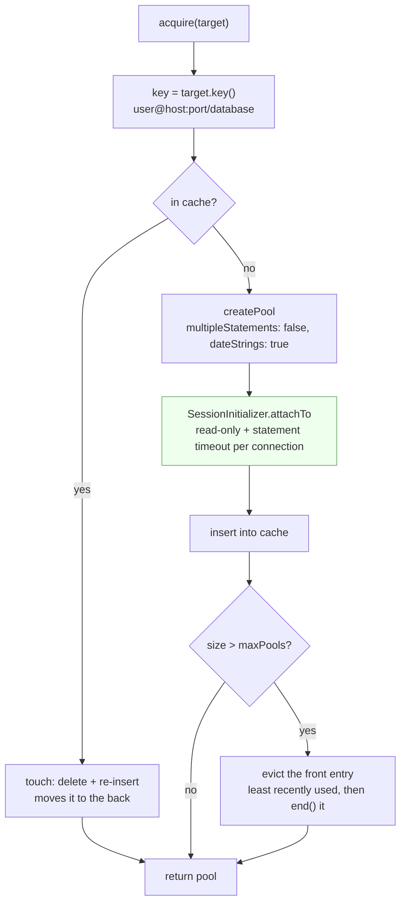
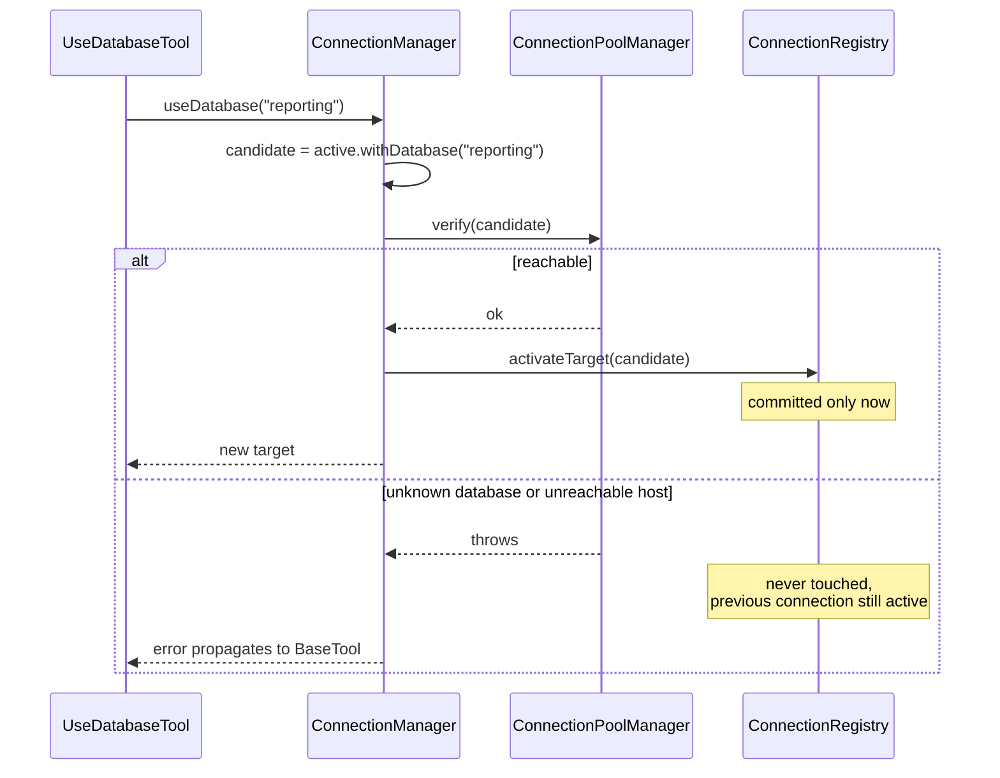

# Database Layer

`src/database/`: turning a `ConnectionTarget` into a live connection, and keeping every connection read-only.

## `ConnectionPoolManager`

One `mysql2` pool per distinct connection, keyed by `ConnectionTarget.key()`, capped and evicted least-recently-used.

This is what makes switching cheap. Changing database selects a different pool rather than reconnecting, and switching back reuses a warm one.

### `acquire(target)`

Cache hit calls `touch`, which deletes and re-inserts the entry. A `Map` iterates in insertion order, so re-inserting moves an entry to the back and leaves the least recently used at the front. That is a complete LRU for two `Map` operations and no extra bookkeeping.

Cache miss builds a pool. The options that matter:

| Option | Value | Why |
| --- | --- | --- |
| `connectionLimit` | 3 | One assistant asking questions is not a web app. Enough for a little overlap, small across several cached pools. |
| `multipleStatements` | **false** | See below. |
| `waitForConnections` | true | Queue rather than error when all three are busy. |
| `connectTimeout` | 10s default | An unreachable host must fail in seconds, not hang the session. |
| `dateStrings` | true | Dates come back as MySQL stored them. `Date` objects would be serialised by `JSON.stringify` into UTC ISO strings, silently shifting every timestamp by the server's offset. |

#### Why `multipleStatements: false` matters so much

With it enabled, `query("SELECT 1; DROP TABLE users")` runs both statements, and the entire read-only guarantee would rest on the validator correctly finding every separator, including ones inside literals and comments.

Turning it off moves that guarantee into the driver. Even a validator bug cannot produce a second statement, because the protocol will not carry one. The `SingleStatementRule` then becomes a better error message rather than the only thing standing between a user and a dropped table.

The cost is that `run_query` cannot return multiple result sets, which is an acceptable trade on a read-only server.

### `verify(target)`

Acquires the pool and runs `SELECT 1`.

Called by `ConnectionManager` before committing a switch, so a bad database or unreachable host fails at the moment it is requested rather than surfacing later on an unrelated query. It also warms the pool, so the first real query after a switch does not pay connection setup.

### `evictOverflow()`

Caps the cache at `maxPools` (8) and closes what it drops. Without a cap, a session touring many databases accumulates a pool each, holding up to three connections apiece; eight bounds that at 24 while being far more than anyone flips between in one conversation.

It runs **after** insertion, so the cap is briefly exceeded then corrected. Evicting first would risk dropping the pool about to be used. `pool.end()` failures are swallowed: a pool being discarded may already be broken, and failing to close one nobody will use again is not worth surfacing.

### `closeAll()`

Clears the map **before** awaiting, so a query arriving mid-shutdown creates a fresh pool rather than using one being torn down. Closes run concurrently and failures are swallowed, because shutdown must not stall on one unreachable server.

Closing pools is also what allows the process to exit at all: open sockets keep the Node event loop alive. That has a direct consequence for shutdown handling, covered in [Server Lifecycle](Server-Lifecycle).

## `SessionInitializer`

Applies the server-side half of the read-only guarantee to every connection a pool opens.

Its own class because it is the security-critical part and deserves to be findable on its own. The pool manager decides *when* connections exist; this decides *what they may do*.

`attachTo(pool)` hooks the pool's `connection` event, which fires once per physical connection: once per connection rather than once per query, and automatically covering connections opened later as the pool grows.

**`SET SESSION TRANSACTION READ ONLY`** sets the access mode for subsequent transactions. With autocommit on, every statement is its own transaction, so MySQL rejects any write with error 1792. It cannot be undone from a query, because `SET` is not an allowed leading keyword and statement stacking is impossible.

**`SET SESSION MAX_EXECUTION_TIME`** caps `SELECT` execution server-side, so a runaway query is killed by MySQL instead of hanging the conversation.

This is the layer that holds if the validator is ever wrong. The two are independent by design: a parser bug should not automatically be a write. An integration test asserts `@@session.transaction_read_only` is `1`, so it cannot quietly stop being applied.

### Why failures are logged, not thrown

A pool `connection` event handler has nowhere to propagate a rejection to, so an unhandled one would take the process down. A connection that could not be set read-only is still guarded by the validator, so continuing is correct; crashing on a MySQL variant lacking one of these variables is not.

The logger is injected rather than calling `console.error` directly, which keeps the class free of any assumption about where output goes.

## `QueryExecutor`

A thin Facade over the registry and the pool manager, so tools never have to know how a target becomes a pool.

### `resolveTarget(database?)`

The single place a call decides which connection it belongs to. No argument means the active connection; a database name means the active connection pointed at that schema for this call only.

Centralising it is why the per-call `database` override costs one argument in each tool rather than a branch in each one.

### `execute(sql, params?, database?)`

Values go through placeholders wherever the query shape allows. MySQL cannot parameterise identifiers, which is why tools validate every identifier before interpolating; see [Read Only Enforcement](Read-Only-Enforcement).

Returns rows only, discarding mysql2's `fields` half, since no caller needs column metadata.

## Adding a field to a connection

1. Add it to `ConnectionTargetProps` and `ConnectionTarget`.
2. Default it in `ConnectionTargetFactory`, in both `create` and `createFromValues`.
3. Decide whether it belongs in `key()`. **If it distinguishes two otherwise identical connections it must be included**, or the second will silently reuse the first one's pool.
4. Pass it through in `ConnectionPoolManager.createPool`.
5. Add it to `ConnectTool.inputSchema`.
