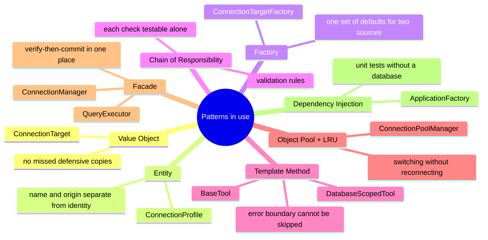
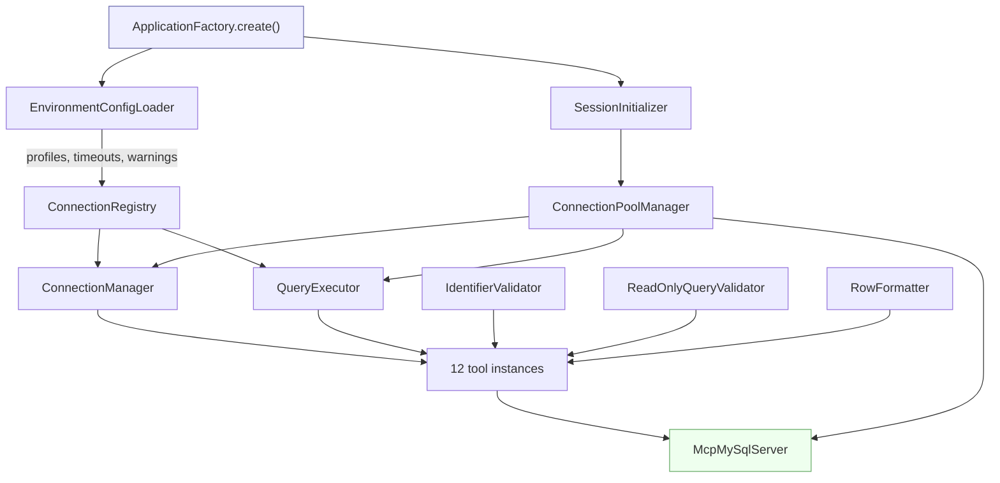

# Design Patterns

Each pattern here earns its place by solving a problem the previous procedural version actually had. Patterns applied for their own sake make a codebase harder to read, so this page records what each one bought.

## Value Object: `ConnectionTarget`

`src/domain/ConnectionTarget.ts`

Immutable, frozen, equality by value. `withDatabase()` returns a new instance.

**Problem solved.** The procedural version passed plain objects and spread-copied them on every assignment. A single missed copy meant mutating the active connection silently rewrote the profile it came from, so `use_database` permanently rebased a profile and `use_connection` could never get back. There was a test pinning the copy; now there is no setter to forget.

It also gives connection identity a home: `key()` is both the pool cache key and the display string, so the two cannot drift apart.

## Entity: `ConnectionProfile`

`src/domain/ConnectionProfile.ts`

A name and an origin wrapped around a target, with named constructors `fromEnvironment` and `fromSession`.

**Why separate from the target.** The same endpoint can be reachable as a configured profile and as an ad-hoc alias in one session. A name is not part of a connection's identity, so it does not belong in the value object.

`describe(isActive)` lives here so the display rule sits with the entity rather than being rebuilt by every caller that wants to list profiles.

## Factory: `ConnectionTargetFactory`

`src/connections/ConnectionTargetFactory.ts`

**Problem solved.** Targets are built from two very different sources: parsed JSON out of `MYSQL_PROFILES`, and typed arguments from the `connect` tool. Both need the same defaults, and the JSON path additionally needs every field type-checked. When that logic lived inline in two places it could drift, so a profile and an ad-hoc connection could disagree about what `host` defaults to.

## Strategy + Chain of Responsibility: validation rules

`src/validation/rules/`, assembled by `ReadOnlyQueryValidator`

Each rule implements `ValidationRule` and either objects or returns `null`. The validator walks the chain and returns the first objection.

**Problem solved.** The old validator was one function whose five checks were interleaved with the parsing they depended on. Changing one meant reading all of it, and no single check could be tested alone.

Rules are injected, so a test can assemble a two-rule chain and assert on ordering. `ReadOnlyQueryValidator.test.js` does exactly that, including an empty chain that proves rules are the only gate.

## Template Method: `BaseTool` and `DatabaseScopedTool`

`src/tools/BaseTool.ts`, `src/tools/DatabaseScopedTool.ts`

`BaseTool` fixes `register` and `invoke`; subclasses supply only `execute`. `DatabaseScopedTool` refines it one step further, implementing `execute` to validate the shared `database` argument and delegating to `read`.

**Problem solved.** Previously every handler had to remember to call a `guard()` helper, and each of six read tools repeated the same `checkDatabaseParam` call. A new tool could silently omit either. An MCP server that throws out of a handler can take the client's session with it, so "cannot be forgotten" is worth a base class.

## Object Pool + LRU: `ConnectionPoolManager`

`src/database/ConnectionPoolManager.ts`

One `mysql2` pool per distinct `ConnectionTarget`, capped and evicted least-recently-used.

**Problem solved.** This is what makes runtime switching cheap: changing database selects a different pool instead of reconnecting, and switching back reuses a warm one. The cap bounds total open connections when a session tours many databases.

## Facade: `QueryExecutor` and `ConnectionManager`

`src/database/QueryExecutor.ts`, `src/connections/ConnectionManager.ts`

`QueryExecutor` hides the registry-plus-pool dance behind `execute(sql, params, database)`. `ConnectionManager` is the only thing that changes the active connection.

**Problem solved for `ConnectionManager` specifically.** Every switch must verify the connection before committing to it, which is what makes a failed switch harmless. The registry cannot enforce that without taking a dependency on the database, and three separate tools should not each be trusted to remember it.

## Dependency Injection with a composition root

`src/ApplicationFactory.ts`

Every class receives its collaborators through its constructor and constructs none of them. All wiring happens in one file.

Each arrow is a constructor argument. Nothing in the graph reaches for a global, which is the property the tests depend on.

**Problem solved.** This is the change that made the test suite possible. `EnvironmentConfigLoader` takes the environment as an argument, so a case is an object literal; previously tests re-imported the module with `?case=N` to defeat the ESM cache and stubbed `console.error` to capture warnings. `ConnectionManager` takes the pool manager, so verify-then-commit can be tested with a fake and no database at all: `ConnectionManager.test.js` covers failed switches, which previously needed a real MySQL.

Unit tests went from 95 to 141 as a direct result.

## Ports and adapters, lightly

`ConfigurationLoader` in `src/types/config.types.ts` is an interface; `EnvironmentConfigLoader` is one implementation.

The seam exists because configuration could plausibly come from a file or a secret store later, and because tests can supply a literal. It is deliberately the only such abstraction: there is no `IConnectionRegistry` or `IQueryExecutor`, because nothing needs a second implementation and an interface per class is noise.

## Patterns deliberately not used

**Singleton.** The old module-level state was effectively one, and it was the main obstacle to testing. Lifetime is now the composition root's decision.

**Repository over the pool.** `QueryExecutor` is thin on purpose. Wrapping MySQL in a generic repository would add a layer without removing the fact that these tools send SQL.

**Observer for connection changes.** Nothing needs to react to a switch. Pools are looked up lazily by key, so there is no cache to invalidate.

**An interface for every class.** Only `ConfigurationLoader` has one, for the reason above.
