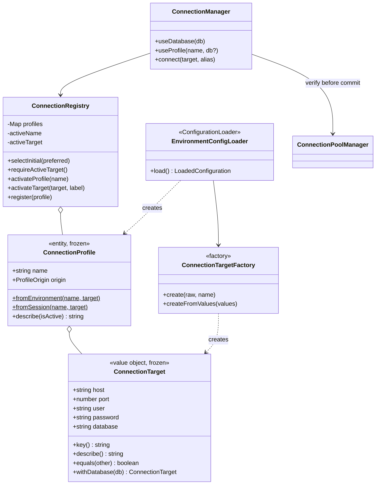
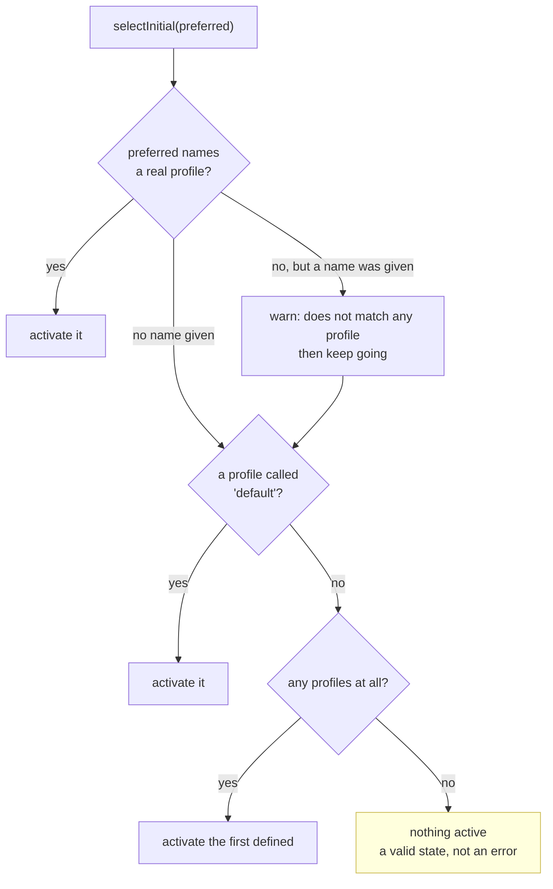

# Domain and Configuration

Covers `src/domain/`, `src/connections/` and `src/config/`: where connections come from, and which one is active.

## `ConnectionTarget`

`src/domain/ConnectionTarget.ts` — an immutable value object holding host, port, user, password and database.

Every field is present by the time an instance exists, so nothing downstream re-applies defaults or handles `undefined`. The constructor calls `Object.freeze`.

### `key()`

Renders `user@host:port/database`. This is both the pool cache key and the display string, so identity and presentation cannot drift apart.

**The password is excluded deliberately.** It is not what makes two connections the same endpoint, and this string is shown to users and written to logs. A unit test asserts a password cannot leak through it.

If you add a field that distinguishes two otherwise identical connections, it must appear here, or the second will silently reuse the first one's pool.

### `withDatabase(database)`

Returns a new instance pointing at a different schema; the receiver is untouched. This is why switching schema is cheap and why the registry needs no defensive copying. See [Design Patterns](Design-Patterns) for the bug this removed.

### `equals(other)`

Compares the key **and** the password, so a corrected password counts as a different connection even though it addresses the same endpoint.

## `ConnectionProfile`

`src/domain/ConnectionProfile.ts` — a name and an origin wrapped around a target.

Named constructors say what a profile is rather than making callers pass a string:

- `fromEnvironment(name, target)` came from configuration and returns after a restart.
- `fromSession(name, target)` was opened by `connect` and disappears on exit.

`describe(isActive)` renders the `list_connections` line including the `* ` active marker, keeping the display rule with the entity.

## `ConnectionTargetFactory`

`src/connections/ConnectionTargetFactory.ts` — builds targets from untrusted input.

`user` and `database` are required and throw `InvalidProfileDefinitionError`; everything else has a default.

**`DEFAULT_HOST` is `host.docker.internal`.** The server almost always runs in a container while MySQL runs on the host, and there `localhost` means the container itself. That is the single most common setup mistake with a containerised database client, so the default makes the usual case work with no `host` key at all.

`readPort` accepts only a real positive integer. A port given as the string `"3306"` falls back to the default rather than becoming `NaN` and failing much later with an unrecognisable error.

Two entry points, sharing the defaults:

- `create(raw, profileName)` for parsed JSON, type-checking every field.
- `createFromValues(values)` for already-typed arguments from the `connect` tool.

Error messages name the profile, because with several profiles in one variable an error that does not say which entry broke is nearly useless.

## `EnvironmentConfigLoader`

`src/config/EnvironmentConfigLoader.ts` — implements `ConfigurationLoader`.

It takes the environment as a constructor argument, defaulting to `process.env`. That one decision is what makes its tests object literals instead of module reloads.

Two properties are deliberate:

**Nothing is logged here.** Problems are returned as `warnings` and `ApplicationFactory` decides where they go. The loader stays pure, and tests assert on warnings rather than intercepting console output.

**Nothing is fatal.** Malformed JSON, a broken profile, or no configuration at all all produce a usable result. A server that starts and explains the problem can be fixed with `connect` in the same conversation; one that exits during handshake is reported by the client as a broken install, which is indistinguishable from a wrong image or path.

### The single-connection fallback

`MYSQL_USER` plus `MYSQL_DATABASE` register a profile named `default`. This is what makes the image a drop-in replacement for a conventional fixed-connection MySQL MCP server: an existing config keeps working and the switching is discovered later.

It never overwrites a `default` defined in `MYSQL_PROFILES`, since explicit configuration wins over a fallback.

## `ConnectionRegistry`

`src/connections/ConnectionRegistry.ts` — the profiles, and the active connection.

This is the only mutable state that makes runtime switching possible. It holds no database machinery on purpose: verifying that a connection works belongs to `ConnectionManager`, which keeps this class free of I/O and trivial to test.

### `selectInitial(preferredName)`

Chooses the starting connection: the requested name, then a profile called `default`, then the first defined, then nothing.

Ending at `nothing active` is why the server still starts with no configuration: the tools then point the user at `connect`.

Returns a warning string rather than logging, and a name that matches nothing is a warning rather than a failure. Such a name is usually a typo, and the useful response is to start anyway and say so.

Ending with nothing active is a valid state, not an error.

### `requireActiveTarget()`

Throws `NoActiveConnectionError`, whose message names both ways out (`connect`, or `use_connection`). Tool handlers convert thrown errors into tool results, so that message is what the user reads: the error *is* the documentation for the unconfigured state.

`getActiveTarget()` returns `null` instead of throwing, so `current_connection` can report the unconfigured state as ordinary output.

### `register(profile)`

Adds an alias opened at runtime. An existing name is replaced, so reconnecting with corrected credentials fixes the entry rather than failing.

### `activateTarget(target, label)`

No defensive copy, unlike the procedural version, because `ConnectionTarget` is immutable. A unit test pins the consequence: moving the active database cannot rewrite the stored profile.

## `ConnectionManager`

`src/connections/ConnectionManager.ts` — the only thing that changes the active connection.

Its whole reason to exist is one rule: **verify, then commit**. `pools.verify(candidate)` runs before `registry.activateTarget(...)`, so a failed switch leaves the previous connection active and the session usable.

The registry cannot enforce that without depending on the database, and three separate tools should not each be trusted to remember it.

| Method | Notes |
| --- | --- |
| `useDatabase(database)` | Keeps the current profile label: the connection is still "staging", just pointed elsewhere. |
| `useProfile(name, database?)` | Throws `UnknownProfileError` with the known names **before** any network work, so a typo fails instantly. |
| `connect(target, alias)` | Verifies, registers the alias as a session profile, then activates. Credentials live in memory only. |

`ConnectionManager.test.js` covers all of this with a fake pool manager and no database, including that a failed `connect` registers nothing.
