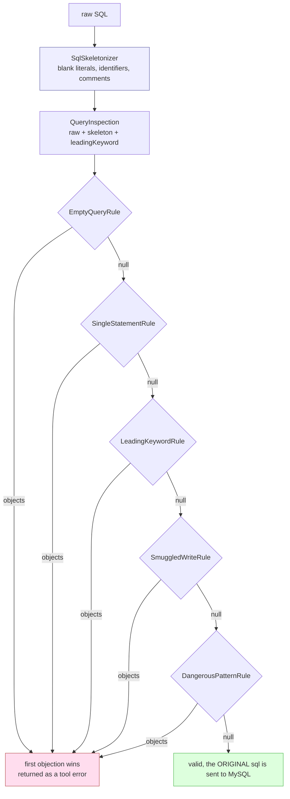
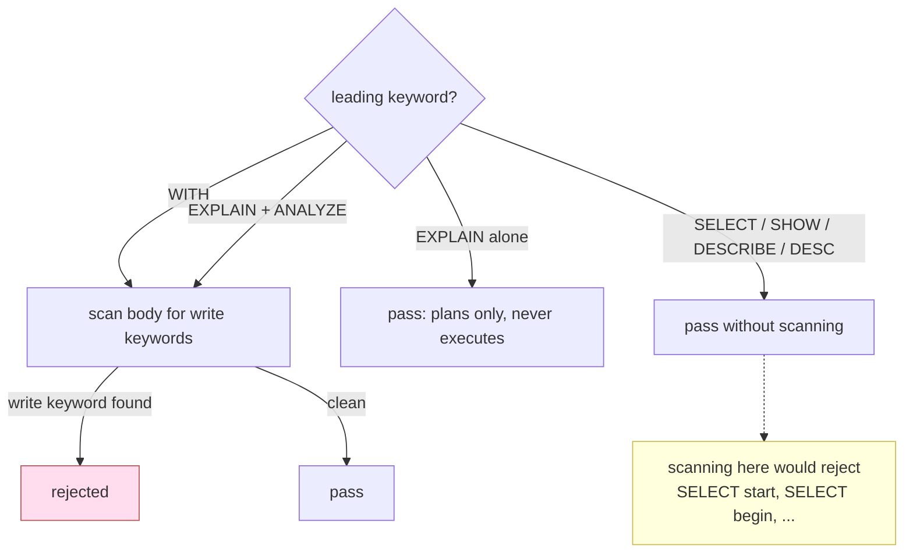

# Read Only Enforcement

`src/validation/`. No I/O, no state, no imports beyond types. This is the layer most worth understanding before changing anything, because each rule closes a specific hole.

## The threat model

Statements reaching `run_query` are written by a language model, usually from a plain-English request. The realistic risk is not an attacker with a crafted payload; it is a model reading "clean up the test rows" as licence to `DELETE`, or a user pasting a migration script.

That shapes two things. False rejections are expensive, because a query wrongly refused makes the tool feel broken and people route around it. And the guard does not need to survive someone who already holds write credentials and a MySQL client; it needs to make an accidental write impossible through this path.

## `SqlSkeletonizer`

Reduces a statement to its syntactic skeleton, replacing every string literal, quoted identifier and comment with whitespace. Every rule inspects the skeleton; the original string is what reaches MySQL.

Handles `'...'`, `"..."`, `` `...` ``, backslash escapes, doubled-quote escapes (`'it''s'`), `-- ` and `#` line comments, and `/* */` blocks.

Its own class because every rule depends on it and none should reimplement it.

### Why not regular expressions

**A naive splitter is wrong in both directions.** Splitting on `;` rejects `SELECT 'a;b'`, an ordinary query, while a `;` inside a comment can hide a second statement from a check that strips comments imperfectly.

**Keyword scanning is worse.** `SELECT * FROM t WHERE status = 'DELETE'` contains the word DELETE, and so does a column named `` `delete` ``. Blanking literals and quoted identifiers first is what makes the write-keyword rule usable at all.

A regex version was tried and dropped. Its failure mode was false rejections of ordinary queries, which is the worst outcome here. These constructs nest and escape in ways regular expressions cannot express correctly.

A line comment is only recognised when `--` is followed by whitespace or end of input, matching MySQL, so `SELECT 1--2` stays arithmetic.

## `ReadOnlyQueryValidator`

Walks an injected chain of rules and returns the first objection.

Note what is sent to MySQL: the **original** statement. The skeleton exists only to decide whether it may run.

`inspect()` builds the `QueryInspection` every rule shares: the raw SQL, the trimmed skeleton with a single trailing semicolon removed, and the leading keyword with leading parentheses stripped so `(SELECT 1) UNION (SELECT 2)` is recognised.

Rule order matters and is fixed in `defaultRules()`: empty first so later rules can assume content, and the leading keyword before the smuggled-write scan, which is conditional on it.

## The rules

### `EmptyQueryRule`

Catches the empty string, whitespace, a bare semicolon and a statement that was nothing but a comment, since all four arrive as an empty skeleton.

### `SingleStatementRule`

Any remaining `;` in the skeleton is a real separator. A trailing one is already stripped, since people paste queries that way.

This is a better error message rather than the actual protection: `multipleStatements: false` means a second statement cannot reach MySQL regardless. See [Database Layer](Database-Layer).

### `LeadingKeywordRule`

Allows `SELECT`, `WITH`, `SHOW`, `DESCRIBE`, `DESC`, `EXPLAIN`.

`WITH` is included because rejecting CTEs outright is a real loss on a read-only analysis tool, and analytical queries are exactly what people use this for. That inclusion is why the next rule exists.

The error names the offending keyword, because a model told precisely what was wrong usually rewrites the query correctly on its own.

### `SmuggledWriteRule`

Scans the body for write keywords, but **only** for two forms:

- `WITH c AS (...) DELETE FROM t` is legal MySQL 8 and writes despite an allowed first word.
- `EXPLAIN ANALYZE` genuinely executes the statement, unlike plain `EXPLAIN`, which only plans it and is therefore allowed.

**The scan is deliberately not applied to plain SELECT.** MySQL cannot turn a SELECT into a write, so scanning adds no safety there, and it actively breaks ordinary queries: `SELECT start FROM sessions` contains START, `SELECT begin, end FROM ranges` contains BEGIN. Those are realistic column names. A global scan was tried first and failed on exactly these, and the unit suite keeps cases for all of them.

The residual cost is that a column named exactly `update` inside a `WITH` query must be backticked. Narrow, documented, and far cheaper than rejecting common column names everywhere.

### `DangerousPatternRule`

`INTO OUTFILE`, `INTO DUMPFILE` and `LOAD DATA` write files on the database server. They begin with SELECT, pass every rule above, and are the classic route from read access to something worse.

`SLEEP` and `BENCHMARK` are not a security problem; they hang the conversation. Blocking them is a blunt availability guard and the one rule that will occasionally frustrate someone measuring query cost. That is documented rather than solved, because the alternative is a tool call that never returns.

This rule applies to every statement, so a sloppy addition causes false rejections everywhere.

## `IdentifierValidator`

Requires `^[A-Za-z0-9_$]+$`.

MySQL cannot parameterise identifiers, so a table name reaching `` SHOW COLUMNS FROM `${table}` `` is string interpolation. This allowlist is what makes that safe: nothing matching it can close the backtick, so nothing can escape the quoted identifier.

An allowlist rather than a denylist, because a denylist must be right about every encoding and escape MySQL accepts, while an allowlist need only be right about what a normal identifier looks like.

The cost is that identifiers needing quoting (spaces, hyphens, Unicode) are rejected. For those, `run_query` with a hand-written statement is the escape hatch, and it goes through the full SQL validator instead.

The `label` parameter puts the right noun in the message, since one generic error across six tools leaves the reader guessing which argument was wrong.

## Adding or changing a rule

1. Implement `ValidationRule`: a `name`, and `evaluate` returning an objection or `null`.
2. Add it to `ReadOnlyQueryValidator.defaultRules()` in the right position.
3. Export it from `src/validation/rules/index.ts`.
4. **Add unit tests on both sides**: the thing it blocks, and an ordinary query it must not block.

That last point is the one that matters. Making the validator stricter is easy and usually breaks ordinary queries; the "literals are never read as SQL" and "reads that must be allowed" blocks in `ReadOnlyQueryValidator.test.js` exist to catch exactly that, and the chain-composability tests show how to exercise one rule in isolation.
