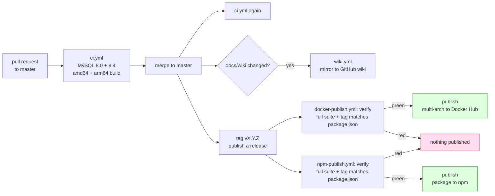

# Release Process

Four workflows in `.github/workflows/`.

| Workflow | Trigger | Does |
| --- | --- | --- |
| `ci.yml` | PR to `master`, push to `master` | Typecheck, build, tests on MySQL 8.0 and 8.4, multi-arch image build, handshake smoke test |
| `docker-publish.yml` | GitHub release published, manual | Re-verifies, then builds and pushes to Docker Hub |
| `npm-publish.yml` | GitHub release published, manual | Re-verifies, then publishes the package to npm |
| `wiki.yml` | Push to `master` touching `docs/wiki/**`, manual | Mirrors `docs/wiki/` into the GitHub wiki |

The two publish workflows run independently off the same release, so a failure on one does not block the other. Either can be re-run on its own from `workflow_dispatch`.



## One-time setup

### Docker Hub secrets

In **Settings → Secrets and variables → Actions**:

| Secret | Value |
| --- | --- |
| `DOCKERHUB_USERNAME` | Your Docker Hub username |
| `DOCKERHUB_TOKEN` | An access token from Docker Hub → Account Settings → Personal access tokens, with Read/Write |

Use a token, not your password: it is scoped and revocable on its own.

The publish workflow checks both are present and fails with a clear message if not, rather than failing later inside the login step.

### npm publishing

`npm-publish.yml` supports two ways in and picks one automatically.

**Trusted publishing (preferred).** npm authenticates the workflow over OIDC, so nothing long-lived is stored in the repository, and provenance is attached automatically for a public package from a public repository. Configure it once on npmjs.com under the package's **Settings → Trusted publishers**, pointing at this repository and `npm-publish.yml`.

**A token (fallback).** Set an `NPM_TOKEN` repository secret with an automation token from npmjs.com. The workflow uses it whenever it is present, and passes `--provenance` explicitly.

The chicken-and-egg part: a trusted publisher cannot be configured until the package exists on npm, so the very first release has to arrive either by a manual `npm publish` or on the token path. After that, delete `NPM_TOKEN` and the workflow falls back to OIDC on its own.

Both paths need `id-token: write`, which the workflow declares.

### Initialise the wiki

**The wiki repository does not exist until the first page is created.** Open the repository's Wiki tab, create any page, save it. `wiki.yml` will then overwrite it on the next run.

Without this the workflow fails at the clone step; it prints an explicit message saying what to do.

If your organisation does not allow `GITHUB_TOKEN` to write the wiki, create a fine-grained PAT with wiki write access and store it as `WIKI_TOKEN`. The workflow prefers it and falls back to `GITHUB_TOKEN`.

## Cutting a release

1. Update `version` in `package.json`.
2. Merge to `master` with CI green.
3. Tag and create a GitHub release, with the tag matching the version prefixed by `v`:
   ```bash
   git tag v1.1.0
   git push origin v1.1.0
   ```
   Then publish a release for that tag in the GitHub UI.
4. `docker-publish.yml` and `npm-publish.yml` both run automatically.

### The tag must match package.json

The workflow compares the release tag against `package.json` and fails if they disagree. A release tagged `v1.1.0` built from a tree still saying `1.0.0` produces an image reporting the wrong version to every client through the MCP handshake, which is very hard to debug later.

### Tags produced

A release of `v1.2.3` pushes:

```
shibbirweb/mcp-mysql-read-only:1.2.3
shibbirweb/mcp-mysql-read-only:1.2
shibbirweb/mcp-mysql-read-only:1
shibbirweb/mcp-mysql-read-only:latest
```

`latest` is skipped for prereleases, so tagging `v2.0.0-rc.1` does not hand every `latest` user a release candidate.

The rolling `1.2` and `1` tags let people pin to a compatibility level rather than an exact build or an unpinned `latest`.

### npm dist-tags

A normal release publishes under `latest`, which is what a bare `npx mcp-mysql-read-only` resolves to. A GitHub prerelease publishes under `next` instead, for the same reason `latest` is withheld on Docker Hub.

An npm version is permanent. It cannot be replaced, and unpublishing is restricted, so a mistake is corrected only by releasing a higher version. `npm-publish.yml` refuses upfront if the version in `package.json` is already on the registry, which is what a re-run of an already-published release would otherwise hit as an opaque `E403`.

The tarball is built by `prepack`, which runs for both `npm pack` and `npm publish`, so `dist/` cannot be stale: it is gitignored and therefore never comes from the checkout. `prepack` rather than `prepublishOnly` is what lets CI pack and test the exact artifact a release would send.

## Verification before publishing

Both publish workflows have two jobs, and `publish` does not run unless `verify` passes.

`verify` repeats the typecheck, build and full test suite against a MySQL service container. This duplicates CI on purpose: a release can be cut from a tag that CI never saw in that exact state, and publishing an untested artifact is the one mistake that reaches users directly. The few minutes are worth it.

The two workflows carry their own copy of that job rather than sharing one. They are independent gates on purpose: neither release channel should be able to ship on the strength of the other one's green tick.

## Multi-arch builds

Images are built for `linux/amd64` and `linux/arm64`, using QEMU on the amd64 runner for the arm64 layers. Apple Silicon is a large share of the audience for a locally-run MCP server, and an emulated image there is noticeably slow.

Both platforms are also built on every PR, without pushing, so a break in the arm64 path is caught during review rather than during a release.

Build cache uses GitHub Actions cache (`type=gha`), which keeps the arm64 build from dominating CI time.

## Docker Hub description

After a successful push, `peter-evans/dockerhub-description` syncs `README.md` to the Docker Hub page, so the listing cannot drift from the repository.

## Publishing the wiki

`wiki.yml` mirrors `docs/wiki/` into the wiki repository on merge to `master`.

The wiki lives in a separate git repository that GitHub does not keep in sync with the code. Keeping the source in `docs/wiki/` means documentation is reviewed in pull requests alongside the change it describes, instead of being edited in a browser where it silently drifts.

The copy step deletes the wiki's top-level `*.md` first, so a page removed from `docs/wiki/` also disappears from the wiki. Anything committed directly through the wiki UI is overwritten on the next sync: `docs/wiki/` is the source of truth.

Page names come from filenames, so `Read-Only-Enforcement.md` becomes a page linked as `[Read Only Enforcement](Read-Only-Enforcement)`. `_Sidebar.md` is GitHub's special name for the wiki navigation panel.

The job is serialised with a `concurrency` group so two quick merges cannot race to push the wiki.

## Manual runs

Every workflow accepts `workflow_dispatch`. `docker-publish.yml` and `npm-publish.yml` both take an optional tag input for re-publishing a specific tag, for example after fixing a Docker Hub credential or configuring a trusted publisher.
