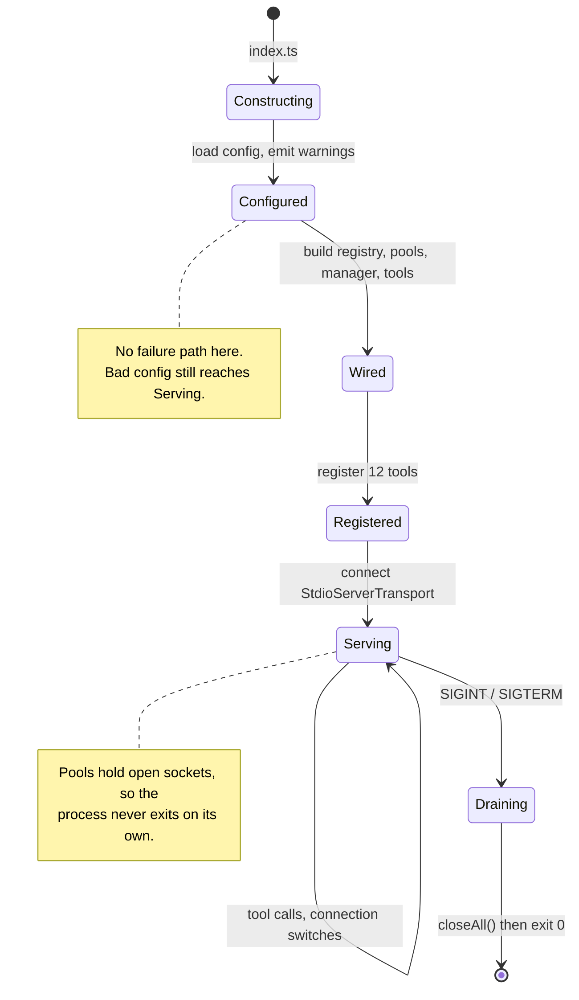
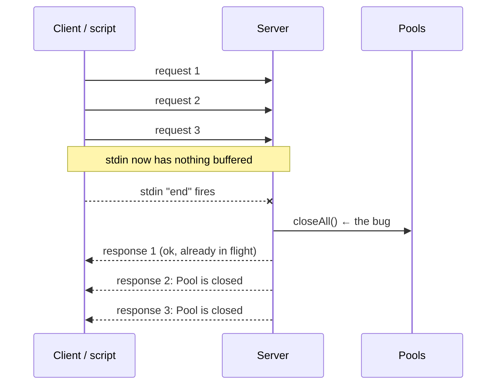

# Server Lifecycle

`src/index.ts`, `src/ApplicationFactory.ts`, `src/server/McpMySqlServer.ts`.

## `index.ts`

Two lines: construct the factory, start what it builds.

There is no configuration check and no exit path here on purpose. A server with no usable connection still starts, still answers `tools/list`, and reports the problem through tool results.

An MCP client cannot show you a stderr message from a process that exited during handshake; it reports "server failed to start", which is indistinguishable from a broken image or a wrong path. A running server that says `No active connection. Call connect...` is diagnosable, and usually fixable in the same conversation.

## `ApplicationFactory`

The composition root: the one place that knows how every part fits together.

Every other class takes its collaborators through its constructor and constructs none of them. That is why they can be unit tested without the environment, without a database and without module-level singletons. All that wiring has to live somewhere, and concentrating it here keeps it out of the classes themselves.



Order in `create()`:

1. Load configuration.
2. **Emit the loader's warnings.** They are collected rather than logged by the loader, so configuration parsing stays pure and testable while the operator still sees problems.
3. Build the registry and choose the starting profile, emitting that warning too.
4. Report the active connection, or that there is none.
5. Build the pool manager with its tuning and a `SessionInitializer`.
6. Build `ConnectionManager` and `QueryExecutor` over them.
7. Build the twelve tools.
8. Hand everything to `McpMySqlServer`.

Both the configuration loader and the logger are constructor parameters with defaults, so a test can build the whole application against a literal environment and capture its output.

### Tuning constants

`POOL_CONNECTION_LIMIT` is 3 and `MAX_POOLS` is 8. They live here rather than in `ConnectionPoolManager` because they are deployment policy, not something the pool needs an opinion about. Together they bound open connections at 24.

## `McpMySqlServer`

Owns the server's lifetime.

Takes tools as an already-constructed list rather than building them, so it knows nothing about MySQL or about which tools exist. Wiring is the factory's job; running is this one's.

`start()` registers every tool **before** connecting the transport, so a `tools/list` arriving immediately after the handshake can be answered. The startup banner goes through the injected logger to stderr: on stdio transport stdout carries JSON-RPC, and one stray byte corrupts the stream.

### Shutdown

```ts
process.on("SIGINT", shutdown);
process.on("SIGTERM", shutdown);
```

The `shuttingDown` flag makes it idempotent. `SIGTERM` followed by `SIGINT`, or a repeated signal from an impatient supervisor, would otherwise run `closeAll()` twice concurrently, the second time over a map already being torn down.

### Why the process cannot exit on its own

Once any query has run, the pool holds open sockets, and open handles keep the Node event loop alive. Without an explicit exit the process runs forever after its client has gone.

That makes it tempting to treat stdin closing as the shutdown signal. **It is a trap, and it was implemented and reverted.**

### The stdin EOF trap

Adding this looks obviously correct:

```ts
process.stdin.on("end", shutdown);   // do not do this
```

It breaks the server. `end` fires when stdin has no more *buffered* data, which is not the same as the client going away. A client that writes several requests and waits reaches EOF while they are still being processed, so the pools are torn down mid-flight and every subsequent call fails with `Pool is closed.`



The first call succeeds and every later one fails, which is exactly how it presented.

This showed up the first time the server was driven by a script that piped its requests in one go: the first call succeeded and every later one failed. Under a real client, which holds stdin open, it would have appeared as an intermittent failure under load.

`SIGTERM` is what MCP clients send when they are genuinely finished. A comment in the source records this so it is not reintroduced.

The consequence for anything driving the server directly: read until you have the responses you expect, then terminate the process. `test/helpers/client.js` does exactly that in `close()`.

## Container considerations

The image runs `node dist/index.js` as PID 1, so Node receives `SIGTERM` from `docker stop` directly and `shutdown` runs. There is no init shim, which is fine for a process that spawns no children.

Clients typically launch it with `docker run -i --rm`. `-i` keeps stdin attached, which the stdio transport requires, and `--rm` means a crashed container leaves nothing behind.

Because the container lives for the whole session, everything held in memory (the active connection, session aliases from `connect`, the pool cache) persists across tool calls. That is precisely what makes runtime switching possible: state in a process that does not restart.
