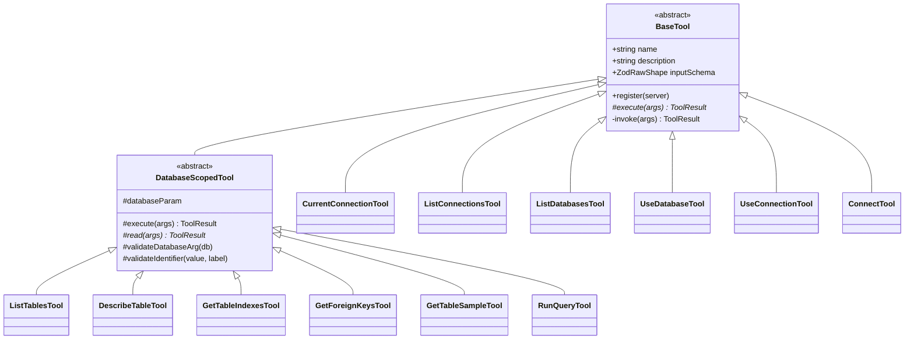
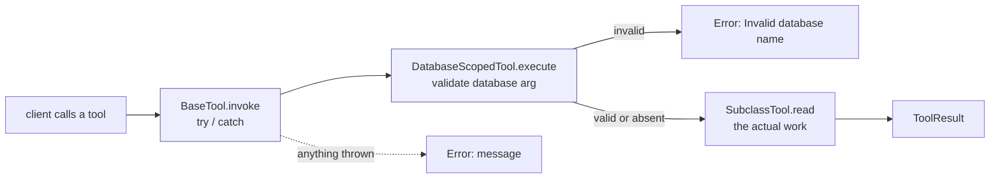

# Tools

`src/tools/`. One class per tool, twelve in all, in two folders: `connection/` changes where queries go, `reading/` reads data.

## The hierarchy

`invoke` is private and `execute` abstract, which is what makes the error boundary impossible to bypass. `DatabaseScopedTool` then implements `execute` itself and leaves `read` abstract, so the `database` guard is equally unskippable:

### `BaseTool`

Template Method. `register` and `invoke` are fixed; subclasses supply `name`, `description`, `inputSchema` and `execute`.

`invoke` is the one place a thrown error becomes a tool error. A dropped connection, a MySQL syntax error or an unconfigured server all arrive there and leave as readable text, so the process stays alive and the user can try again. Previously each handler had to remember to call a `guard()` helper; now it cannot be forgotten. An MCP server that throws out of a handler can take the client's whole session with it, which is why this is a base class rather than a convention.

The single cast in `register` is confined to one line and explained there: the SDK derives a callback's argument type from the schema it is given, which it cannot do for a schema held in an abstract property.

Write `description` for a language model, not a person: it is the only thing telling the assistant when to reach for the tool. `use_database` ends with "Takes effect immediately, no restart needed" precisely so an assistant does not tell the user to restart.

### `DatabaseScopedTool`

Refines the Template Method one step: `execute` is implemented here to validate the shared `database` argument, and subclasses supply `read`.

Without it, six tools would repeat the same guard and a new tool could silently omit it and interpolate an unchecked identifier.

It also owns the shared `databaseParam` schema, so the argument reads identically everywhere, and exposes `validateIdentifier` so subclasses guard table names through one path.

#### The per-call `database` argument

Applies to that call only, leaving the active connection alone.

Two reasons. Comparing two databases otherwise means switching, reading and switching back, with the session left wherever the last call put it. And a call carrying its own database does not depend on shared mutable state, so it cannot be reordered against a switch issued in the same batch: it is the correct answer to the parallel-call race in [Architecture](Architecture).

## Connection tools

### `CurrentConnectionTool`

Reads the nullable accessor rather than the asserting one, so an unconfigured server reports its state as ordinary output instead of an error. Nothing has gone wrong; nothing has been chosen yet.

Renders through `target.describe()`, which keeps the password out of output.

### `ListConnectionsTool`

Delegates each line to `ConnectionProfile.describe(isActive)`, so the display rule lives with the entity. `(env)` versus `(session)` tells the reader whether a connection survives a restart, and `*` marks the active one more legibly than a separate "active:" line.

### `ListDatabasesTool`

Hides `information_schema`, `performance_schema`, `mysql` and `sys` unless `include_system` is set. They are noise in most sessions and make it harder to spot the database you want; the flag exists because inspecting them is occasionally the real task.

Marks the active database, so "where am I and what else is here" is one call.

### `UseDatabaseTool` / `UseConnectionTool` / `ConnectTool`

All three delegate the switch to `ConnectionManager`, so the verify-then-commit rule cannot be got wrong in a tool. See [Domain and Configuration](Domain-and-Configuration).

`UseConnectionTool` lets `UnknownProfileError` propagate: it already carries the known profile names, and `BaseTool` turns it into a tool error. When someone mistypes a profile, seeing the real list is the fastest route to the fix.

`ConnectTool` builds its target through `ConnectionTargetFactory`, so an ad-hoc connection and a configured profile cannot disagree about defaults. `alias` defaults to `custom`, so repeated one-off connections overwrite rather than accumulating. The `host` parameter description spells out `host.docker.internal` because reaching the host's MySQL from a container is the most common setup mistake, and a model reading that description usually gets it right unprompted.

## Reading tools

### `ListTablesTool`

Unwraps `SHOW TABLES` from MySQL's `Tables_in_<database>` single-key objects into a plain list with a count. The raw shape is noisy and its key name varies by database.

### `DescribeTableTool` / `GetTableIndexesTool`

`SHOW COLUMNS` and `SHOW INDEX` with a validated, interpolated table name. `SHOW COLUMNS` rather than an `information_schema` query: shorter output, already scoped to the pool's database.

### `GetForeignKeysTool`

The only read tool using a **placeholder**, because here the table name is a value in a `WHERE` clause rather than an identifier. It is still validated first, so a bad argument fails the same way across every tool.

Scoped by `TABLE_SCHEMA = DATABASE()`, which resolves to the pool's schema and so stays correct under the per-call `database` override, because that override selects a different pool.

Returns a sentence rather than `[]` when there are none: an empty array reads as "the query failed", a sentence reads as an answer.

### `GetTableSampleTool`

The limit is interpolated because MySQL will not accept a placeholder in `LIMIT` on every version. `clampLimit` duplicates the Zod constraint on purpose: the schema is enforced by the client before dispatch, while clamping in the handler means a value reaching the query string cannot be anything but an integer in range, however it got there.

### `RunQueryTool`

Validates with `ReadOnlyQueryValidator` before anything touches the network, so a rejected query costs no connection, then formats through `RowFormatter`.

No parameter binding is exposed. Adding a `params` argument would let an assistant separate values from SQL properly, but models inline their values in practice, and the validator plus the read-only session already bound what a query can do.

## Output

`ToolResponse` builds the MCP content envelope with static factories, so no handler hand-rolls the shape and `isError` is set consistently. The `Error: ` prefix is load-bearing: an assistant reads tool output to decide what to do next, and an unprefixed message is easily mistaken for data.

`RowFormatter` truncates at 100 rows and appends a note naming the real total and the fix. This protects the context window; a `SELECT *` on a large table would otherwise flood the transcript. It truncates *output*, not the query, which is what `MAX_EXECUTION_TIME` is there to bound.

## Adding a tool

1. Create a class under `tools/connection/` or `tools/reading/`, extending `BaseTool` or `DatabaseScopedTool`.
2. Declare an argument interface; extend `DatabaseScopedArgs` if it reads data.
3. Implement `name`, `description`, `inputSchema`, and `execute` or `read`.
4. Validate identifiers with `this.validateIdentifier` before interpolating; use placeholders for values.
5. Register it in `ApplicationFactory.createTools`.
6. Add it to the expected tool list in `test/integration/server.test.js`, which asserts the exact set of twelve, so adding one is a deliberate change.
